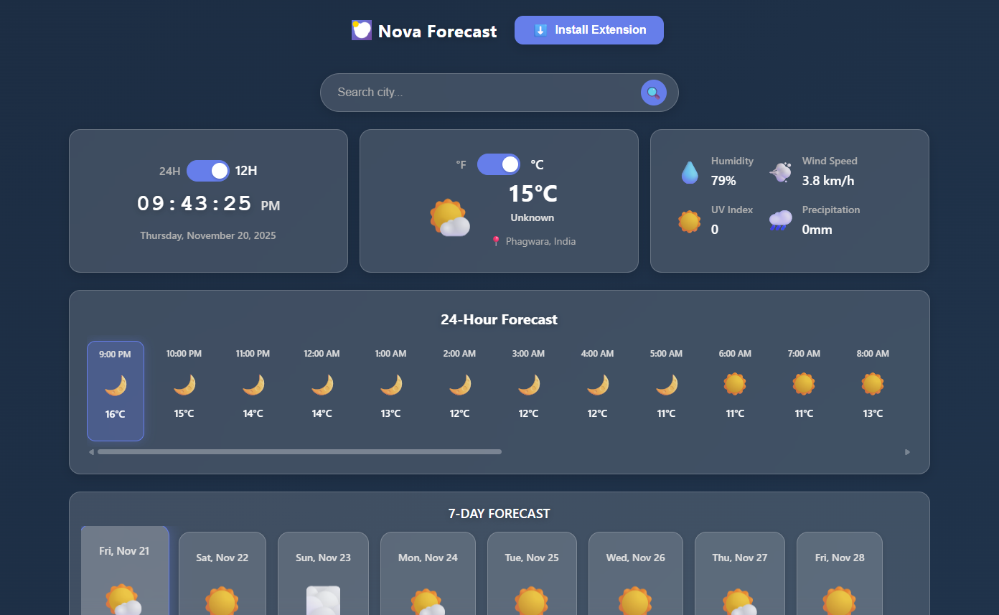

# 🌤️ NovaForecast - Modern Weather App & Browser Extension

A beautiful, modern React weather application with a browser extension that displays weather and time on every website you visit. Built with React 19, Vite, and the free Open-Meteo API.

  

---

## 📋 Table of Contents

- [Features](#-features)
- [Demo](#demo)
- [Getting Started](#-getting-started)
  - [Web Application](#web-application)
  - [Browser Extension](#browser-extension)
- [Installation Guide](#-installation-guide)
  - [Chrome](#chrome-installation)
  - [Edge](#microsoft-edge-installation)
  - [Firefox](#firefox-installation)
  - [Brave](#brave-installation)
- [Project Structure](#-project-structure)
- [Usage](#-usage)
- [Tech Stack](#-tech-stack)
- [API Information](#-api-information)
- [Development](#-development)
- [Features Roadmap](#-features-roadmap)
- [Contributing](#-contributing)
- [License](#-license)
- [FAQ / Troubleshooting](#faq--troubleshooting)
- [Support](#-support)

---

## ✨ Features

### 🌐 Web Application

- 🎨 **Modern UI Design**
  - Glassmorphism, backdrop blur, dynamic gradients & animations
  - Responsive on phones, tablets, desktops

- 📍 **Location Features**
  - Auto-detect location, browser geolocation, city search with autocomplete
  - Location-based timezone support

- ⏰ **Time Features**
  - Accurate local time for searched location with 12/24h toggle
  - Time of day indicators, automatic timezone detection

- 🌡️ **Weather Info**
  - Current conditions, 7-day and 24-hour forecast, interactive cards
  - Humidity, wind, UV index, precipitation, C/F switch, high/low temps

- 💾 **User Preferences**
  - Save favorite locations, persistent temperature/time format, local storage privacy

### 🔌 Browser Extension

- 🌐 **Universal Widget**
  - Weather/time widget on every site (supports Chrome, Edge, Brave, Firefox)
  - Non-intrusive and always present, customizable position and drag-and-drop

- ⚙️ **Settings & Features**
  - Toggle weather/time independently, set units, widget corner, auto-refresh
  - Persist settings across browser sessions, transparent flexible design

- 🕒 **Performance**
  - Weather auto-refresh, time updates every second, light weight

---

## 🖼️ Demo

<p align="center">
  
</p>

<!-- Add actual screenshots (demo1.png, demo-extension.png) in /public for proper display -->

---

## 🚀 Getting Started

### Web Application

#### Prerequisites

- Node.js (v16 or higher)
- npm or yarn

#### Installation

```bash
git clone https://github.com/Shashanklko/NovaForecast.git
cd NovaForecast
npm install
npm run dev
```
The app will be available at [http://localhost:5173](http://localhost:5173)

#### Build for production

```bash
npm run build
npm run preview
```

### Browser Extension

#### Quick Install

1. Download the extension from the [GitHub Releases](https://github.com/Shashanklko/NovaForecast/releases) or this repo.
2. Extract the ZIP file.
3. Proceed with your browser's manual install steps (see below).

#### Manual Installation

Choose your browser below and follow the steps.

---

## 📦 Installation Guide

### Chrome Installation
1. Download/extract this repo, go to `chrome://extensions/`
2. Enable **Developer mode** (top-right).
3. Click **Load unpacked** and select the `extension` folder.
4. Configure via the toolbar icon.

### Microsoft Edge Installation
1. Download/extract this repo, go to `edge://extensions/`
2. Enable **Developer mode** (bottom-left).
3. Click **Load unpacked** & select `extension` folder.
4. Configure via the toolbar icon.

### Firefox Installation
1. Download/extract repo, go to `about:debugging`
2. Click **This Firefox** → **Load Temporary Add-on**
3. Load the `manifest.json` from the `extension` folder.
4. Note: You'll need to reload after browser restart (limitation of Firefox).
5. Configure via the toolbar icon.

### Brave Installation
1. Download/extract repo, go to `brave://extensions/`
2. Enable **Developer mode**.
3. Click **Load unpacked**, select `extension` folder.
4. Configure via the toolbar icon.

---

## 📁 Project Structure

```
NovaForecast/
├── src/                # Web app source code
│   ├── api/
│   ├── components/
│   ├── contexts/
│   ├── hooks/
│   ├── pages/
│   ├── styles/
│   ├── utils/
│   ├── App.jsx
│   └── main.jsx
├── extension/          # Browser extension
│   ├── manifest.json
│   ├── background.js
│   ├── content.js
│   ├── popup.html
│   ├── ...
├── public/             # Static assets (demo images, icons)
├── package.json
├── vite.config.js
├── index.html
└── README.md
```

---

## 🎯 Usage

### Web Application

- Allow location access or use the search bar for custom locations.
- Scroll through hourly/daily forecasts.
- Toggle units and time format with switches.
- Click the header ("NovaForecast") to reload weather data.

### Browser Extension

- Click the extension icon in your toolbar to open settings.
- Show/hide widget, toggle weather/time, pick corner, set units.
- Hold **Shift** then drag the widget for custom positioning—it will snap and save location.
- All settings are persistent across sites and sessions.

---

## 🔧 Tech Stack

- **React 19.1.0**
- **Vite 6.3.5**
- **Axios 1.10.0**
- **CSS3** (custom variables, animations)
- **Open-Meteo API**
- **Manifest V3, Chrome APIs, JS**

---

## 📡 API Information

The app uses the **Open-Meteo API** (no API key required).

**Sample request:**
```
GET https://api.open-meteo.com/v1/forecast?latitude={lat}&longitude={lon}&hourly=temperature_2m,...
```

- **Weather Forecast:** [`/v1/forecast`](https://open-meteo.com/en/docs)
- **Geocoding:** [`/v1/search`](https://open-meteo.com/en/docs#api_form)

**Features:**

- ✅ No API key needed
- ✅ Global coverage
- ✅ High accuracy, generous usage
- ✅ Automatic timezone detection

---

## 🛠️ Development

#### Prerequisites

- Node.js 16+
- Modern browser
- VS Code (recommended)

#### Commands

```bash
git clone https://github.com/Shashanklko/NovaForecast.git
cd NovaForecast
npm install
npm run dev         # Start dev server
npm run build       # Production build
npm run preview     # Preview prod build
npm run lint        # Lint source
```

#### Component Pattern

```
ComponentName/
├── ComponentName.jsx
└── ComponentName.css
```
- Use React functional components, hooks, CSS variables.
- Modular, reusable, accessible.

---

## 🎉 Features Roadmap

- [ ] Weather alerts/notifications
- [ ] Temperature charts
- [ ] Multiple saved locations
- [ ] Weather history/trends
- [ ] Theme customization
- [ ] Widget appearance controls (color/size/opacity)
- [ ] Weather maps
- [ ] Air quality index
- [ ] Sunrise/sunset
- [ ] PWA support
- [ ] Dark/light mode toggle
- [ ] Location comparison
- [ ] Export weather data

**Known Issues:**
- Firefox "Load Temporary Add-on" disables extension on browser restart (per Firefox limitation).
- Older browsers may not support advanced CSS effects.

---

## 🤝 Contributing

Contributions welcome!  
1. Fork this repo
2. Create a feature branch (`git checkout -b feature/AmazingFeature`)
3. Commit (`git commit -m "Add AmazingFeature"`)
4. Push (`git push origin feature/AmazingFeature`)
5. [Submit a Pull Request](https://github.com/Shashanklko/NovaForecast/pulls)

**Guidelines:**
- Observe code style & comments.
- Update docs for new features.
- Test on multiple devices and browsers.
- If major, open a discussion/issue first.

---

## 📝 Notes

- **Privacy:** All location data is stored locally; nothing is ever shared.
- **API:** 100% free, anonymous use.
- **Performance:** Fast, animated, optimized.
- **Compatibility:** Modern browsers (Chrome, Edge, Firefox, Brave, Safari).
- **Accessibility:** Aims to meet web accessibility best practices (feedback welcome).
- **Responsive:** Mobile, tablet, and desktop support.

---

## 📄 License

This project is licensed under the MIT License.  
See the [LICENSE](LICENSE) file for full details.

---

## ❓ FAQ / Troubleshooting

**Extension won’t show or update?**
- Try disabling/re-enabling via your browser’s extension settings.
- For Firefox, add-on must be loaded as "temporary" after each restart (see above).
- Make sure you have the latest browser version.

**Location lookup fails?**
- Try searching for larger cities or allowing browser geolocation.
- Check privacy/settings for location permission.

**Something else wrong?**
- Check the [Issues](https://github.com/Shashanklko/NovaForecast/issues) page or open a new issue.

---

## 📞 Support

- Review the [Issues](https://github.com/Shashanklko/NovaForecast/issues) page for common questions.
- For discussion, feature requests, or bugs: open an issue or start a GitHub Discussion (if enabled).
- For urgent matters, contact me at the email listed in my [GitHub profile](https://github.com/Shashanklko).

---

**Made with ❤️ using React and modern web technologies**

---

_Last updated: 2025-11-20_
